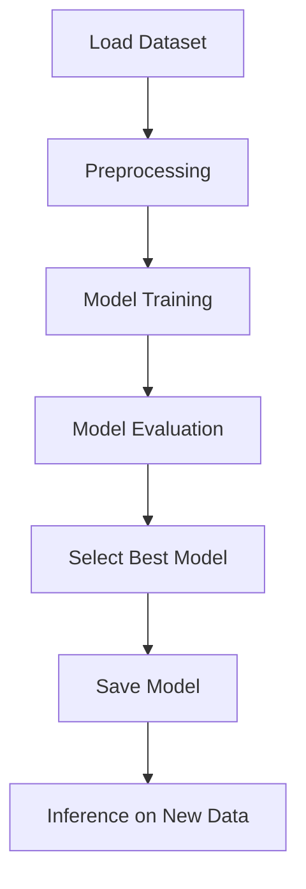

# 📊 Customer Churn Prediction

A complete end-to-end **Machine Learning project** to predict customer churn using the **Telco Customer Churn dataset**.
The repository includes preprocessing scripts, training, evaluation, and inference pipeline — with saved models and reports.

---

## 📂 Project Structure

```
customer-churn-prediction/
├─ data/                     # Raw dataset (Telco-Customer-Churn.csv)
├─ models/                   # Saved trained models (.pkl)
├─ notebooks/                # Jupyter notebooks (EDA & experiments)
│   ├─ 01_data_cleaning.py
│   ├─ 02_model_training.py
│   ├─ 03_model_evaluation.py
│   └─ 04_inference.py
├─ reports/                  # Evaluation results and plots
│   ├─ evaluation_report.csv
│   ├─ images/
│   │   └─ flowchart.png
├─ src/                      # Core source code
│   ├─ preprocessing.py
│   ├─ train.py
│   ├─ evaluate.py
│   └─ predict.py
├─ requirements.txt
└─ README.md
```

---

## ⚡ Quick Start

1. **Create a virtual environment and install dependencies**:

```bash
python -m venv .venv
# Windows
.venv\Scripts\activate
# macOS/Linux
source .venv/bin/activate

pip install --upgrade pip
pip install -r requirements.txt
```

2. **Place dataset** inside:

```
data/Telco-Customer-Churn.csv
```

3. **Run the pipeline step by step**:

* **Preprocessing**

```bash
python notebooks/01_data_cleaning.py
```

* **Training**

```bash
python notebooks/02_model_training.py
```

* **Evaluation**

```bash
python notebooks/03_model_evaluation.py
```

* **Inference (predictions on new data)**

```bash
python notebooks/04_inference.py
```

---

## 🧑‍🤖 What’s Inside?

* **Exploratory Data Analysis (EDA)**: Distributions, correlations, churn insights.
* **Preprocessing**: Handling missing values, encoding categorical features, scaling numerical features.
* **Models**: Logistic Regression, Random Forest, XGBoost, Gradient Boosting.
* **Evaluation**: Accuracy, Precision, Recall, F1, ROC-AUC, Confusion Matrix, ROC curves.
* **Model Selection**: Best model automatically chosen from evaluation report.
* **Inference**: Generate churn predictions for new customers.

---

## 📈 Example Results

Confusion Matrix & ROC Curve plots are automatically saved in the `reports/` folder.
Example:


---

## 🔄 Pipeline Flow

The full workflow is illustrated below:



**Steps:**

1. Load & clean dataset
2. Preprocess features
3. Train models (Logistic Regression, Random Forest, XGBoost, etc.)
4. Evaluate & compare models
5. Save best model
6. Run inference on new customers

---

## 📝 Notes

* Class imbalance is handled with `class_weight='balanced'` and optional SMOTE.
* Reports (`evaluation_report.csv`) summarize all models for comparison.
* The pipeline is modular: you can replace or extend models easily.

---

## 🌍 Summary

This repository provides a **complete ML pipeline** to predict customer churn using the Telco dataset.
It covers the full cycle: **data cleaning → preprocessing → model training → evaluation → inference**, with saved models and visual reports.

